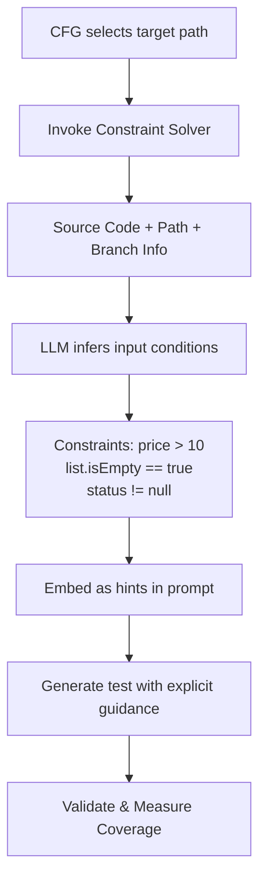

### Constraints-Hints for Path Solving

For complex functions with intricate branch logic, simply instructing the LLM to "cover a specific path" often fails because the decision conditions are buried deep within nested conditionals, method calls, or arithmetic expressions. The LLM struggles to infer the exact input requirements from code structure alone. To address this, we introduce a **Constraints-Hints** mechanism that makes branch conditions explicit during test generation.

#### Approach

The Constraints-Hints module operates within the CFG-guided test generation loop. For each selected path, the system invokes a dedicated LLM (constraint solver) to analyze the path and extract explicit input conditions, which are then embedded into the test generation prompt as hints.



**Example.** Consider a function with nested branches:
```java
public double calculateDiscount(Price price, Customer customer) {
    if (price.getAmount() > 100) {           // branch 1
        if (customer.isVIP()) {                // branch 2
            if (!discountService.isExcluded(customer.getId())) {  // branch 3
                return price.getAmount() * 0.2;
            }
        }
    }
    return 0.0;
}
```

To reach the innermost return statement (branch 1 TRUE, branch 2 TRUE, branch 3 TRUE), the constraint solver outputs:
```
Input Conditions:
- price.getAmount() > 100
- customer.isVIP() == true
- discountService.isExcluded(customer.getId()) == false
```

These explicit conditions guide the LLM to construct appropriate mocks and input values, rather than relying on blind guessing.

#### Implementation

The constraint solving functionality is implemented in `llm_constraint_solver.py`, which:
1. Loads a dedicated prompt template (`constraint_solving_prompt.toml`)
2. Renders the prompt with source code, path information, and the first uncovered branch
3. Invokes the LLM to generate input conditions in a structured format

The generated constraints are integrated into the test generation prompt:

```python
if use_constraints and self.constraint_solver:
    constraints = self.constraint_solver.generate_constraints(
        source_code, path_str, first_branch)
    rendered_template += f"\nConstraints: {constraints}"
```

The feature is enabled via the `use_constraints` configuration flag.
